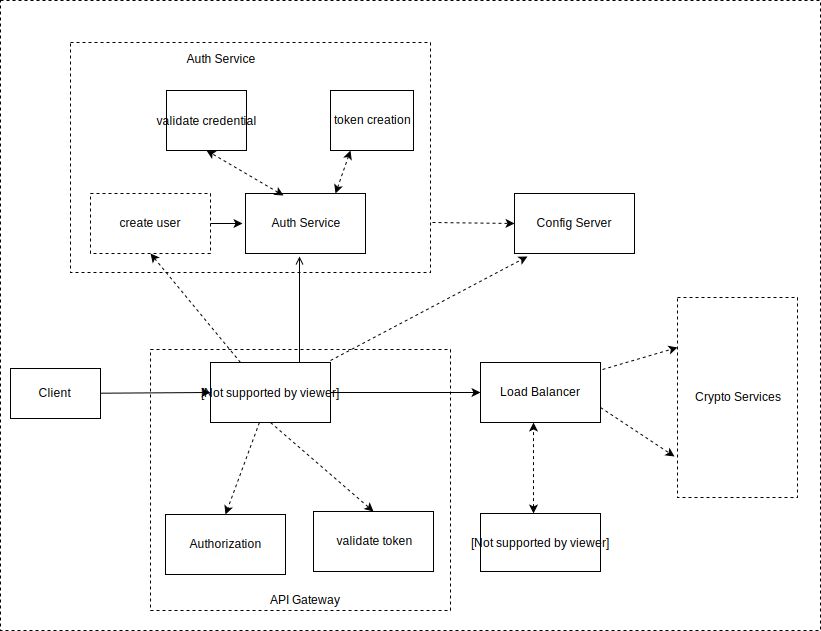

# playing-with-microservices-using-crypto
In this i am trying to perform crypto operations using microservices


# Description: 

In this project we will going to perform crypto operation using our crypto microservices. We will going to use
following things:

1) API Gateway (Zuul)         :   Gateway for all the services. All request must come here  
2) Load Balancer  (Ribbon)    :   Optimize usage of our sevices
3) Service Discovery (Eureka) :   For discovering our services
4) Spring cloud Config Server :   To store all common config 
5) Authentication using JWT   :   JWT for authentication
6) Database (mysql)           :   To store user credentials and roles using hibernate
7) Feign Client               :   To communicate with other microservices
8) Hystrix                    :   For Fault tolreance our services


Component of our project are: 



 

We will going to have all this component implemented step by step. We first have auth services up.


# Authentication Service:

This service is heart of our project as it maintains all the security work. As name suggests this service will validate the credential, issuing token (JWT) to authenticated user, create new user.

By default '/login/' is used for getting token but we are going to use customized uri as read through cloud config server.

# Authentication Workflow

The authentication flow is simple as:

1.	The user sends a request to get a token by passing his credentials.
2.	The server validates the credentials and sends back a token.
3.	With every request, the user has to provide the token, and server will validate that token.

We’ll introduce service called ‘auth service’ for validating user credentials, and issuing tokens.

What about validating the token? Well, it can be implemented in the auth service itself, and the gateway has to call the auth service to validate the token before allowing the requests to go to any service.

Instead, we can validate the tokens at the gateway level, and let the auth service validate user credentials, and issue tokens. And that’s what we’re going to do here.

In both ways, only authenticated request pass.

# Directory Structure:  Auth-Service

 ```bash
───src
   ├───main
      ├───java
      │   └───com
      │       └───tushar
      │           └───crypto
      │               └───auth
      │                   │   AuthServiceApplication.java
      │                   │
      │                   ├───config
      │                   │       JwtConfig.java
      │                   │       SecurityConfig.java
      │                   │
      │                   ├───endpoint
      │                   │       Endpoint.java
      │                   │
      │                   ├───filter
      │                   │       JwtAuthenticationFilter.java
      │                   │
      │                   ├───model
      │                   │       ApplicationUser.java
      │                   │       Credentials.java
      │                   │       Role.java
      │                   │
      │                   ├───repository
      │                   │       DbServiceRepository.java
      │                   │
      │                   └───service
      │                           CustomUserDetailsService.java
      │
      └───resources
             bootstrap.properties
    
 ```
 
# Security Config:

 ```bash
@Configuration
@EnableWebSecurity
public class SecurityConfig  extends WebSecurityConfigurerAdapter {
}
``` 

This class is annotated with @EnableWebSecurity to enable Spring Security’s 
web seurity support and provide the Spring MVC integration. 

It also extends WebSecurityConfigurerAdapter and overrides a couple of its methods to set 
some specifics of the web security configuration.

```
	Security Config does following things
•	Require authentication to every URL in your application 
•	Generate a login form for you 
•	Allow the user with the Username user and the Password password to authenticate with form based authentication 
•	Allow the user to logout 
•	CSRF attack prevention 
•	Session Fixation protection 
•	Security Header integration
o	HTTP Strict Transport Security for secure requests 
o	X-Content-Type-Options integration 
o	Cache Control (can be overridden later by your application to allow caching of your static resources) 
o	X-XSS-Protection integration 
o	X-Frame-Options integration to help prevent Clickjacking 
```

We will have following requirement for our services :
1)	Cross site region and cross region resource feature should be disable
2)	Session should not be maintained. 
3)	All users can request for token and create user request
4)	Authentication and Authorization should be done

 ```bash
@Override
	protected void configure(HttpSecurity http) throws Exception {
 		 http
		 	.cors().and().csrf().disable() 				.sessionManagement().sessionCreationPolicy(SessionCreationPolicy.STATELESS)
			.and()
			.authorizeRequests()
		        .antMatchers("/api/createUser").permitAll() 
		     	.antMatchers(HttpMethod.POST, jwtConfig().getUri().trim()).permitAll() 
			.anyRequest().authenticated()
			.and()
			.addFilter(new JwtAuthenticationFilter(authenticationManager(), jwtConfig()));
	}

 ```

#AuthManager:
 Authentication Manager allows for easily building for memory authentication
 LDAP authentication, JDBC based authentication, adding UserDetailsService, 
 and adding AuthenticationProvider's.
 
We need to load user by database, so we are going to fetch it from custom user service.
So we have to provide instance of our custom user service to auth manager.

 ```bash
	@Override
	protected void configure(AuthenticationManagerBuilder auth) throws Exception {
		 auth.userDetailsService(new CustomUserDetailsService(dbServiceRepository));
	}
```


#Authentication Filter:

 ```bash
public class JwtAuthenticationFilter extends    UsernamePasswordAuthenticationFilter {
}
```

This filter will authenticate the credential, if validated than return token. In case of unsuccessful validation “Invalid credential” response will be returned.

We will override 3 methods:
1)	attemptAuthentication
2)	successfulAuthentication
3)	unsuccessfulAuthentication

 ```bash
	@Override
	public Authentication attemptAuthentication(HttpServletRequest request, HttpServletResponse response)
			throws AuthenticationException {

    Authentication authentication = null;

		try {	
			Credentials credentials = new ObjectMapper()
			                        .readValue(request.getInputStream(), Credentials.class);

			authentication = authenticationManager.authenticate(
					new UsernamePasswordAuthenticationToken(
					   credentials.getUsername(), credentials.getPassword()));
		} catch (UsernameNotFoundException | IOException e) {
			throw new RuntimeException(e.getMessage());
		}

		return authentication;
	}
```

Internally authnetication manager call the user service class(CustomUserDetailsService) to find the user details using username.
CustomUserDetailsService uses JPA repository to find the details. Once user is authenticated we need to return token (JWT)

Structure of JWT:

JWT contains following things:
	    1) Expiry time
	    2) Username
	    3) Role assign to the user
	    4) Secret data	

```bash
@Override
	protected void successfulAuthentication(HttpServletRequest request, HttpServletResponse response, FilterChain chain,
			Authentication authentication) throws IOException, ServletException {

		ZonedDateTime expirationTime = ZonedDateTime
		                                  .now(ZoneOffset.UTC)
						  .plus(jwtConfig.getExpirationTime(), ChronoUnit.MILLIS);


		Claims claims = Jwts
		                  .claims()
				  .setSubject(authentication.getName());
				  
		List<String> roles = authentication.getAuthorities()
		                             .stream()
					     .map(GrantedAuthority::getAuthority)
				             .collect(Collectors.toList());
		claims.put("scopes", roles);

		String token = Jwts.builder()
		                   .setClaims(claims)
				   .setExpiration(Date.from(expirationTime.toInstant()))
				   .signWith(io.jsonwebtoken.SignatureAlgorithm.HS512, jwtConfig.getSecret())
				   .compact();

		response.getWriter().write(token);
	}
```

In case of unsuccessful authentication proper error response will be sent to the user.
